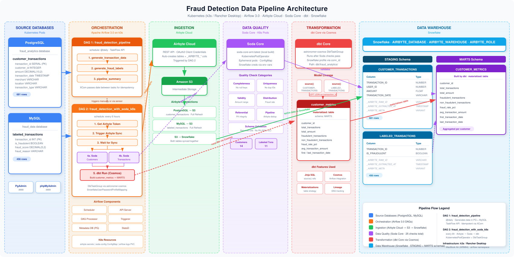
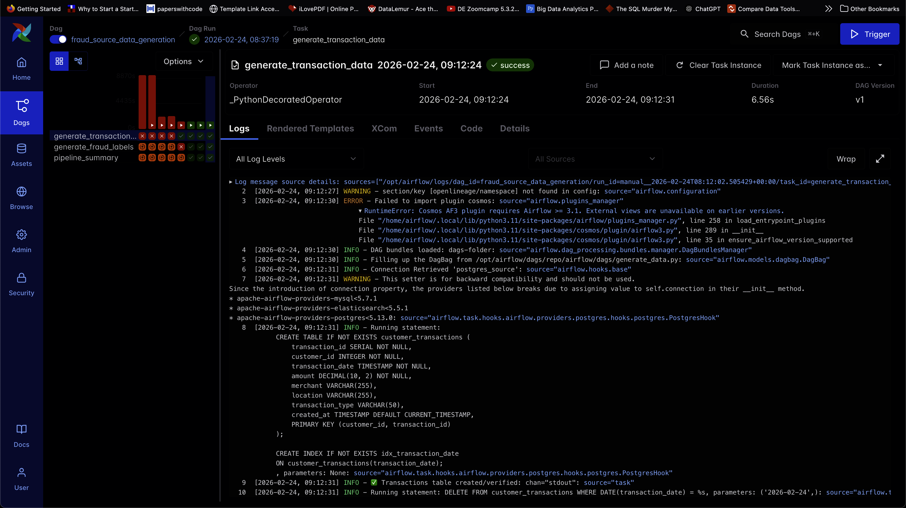
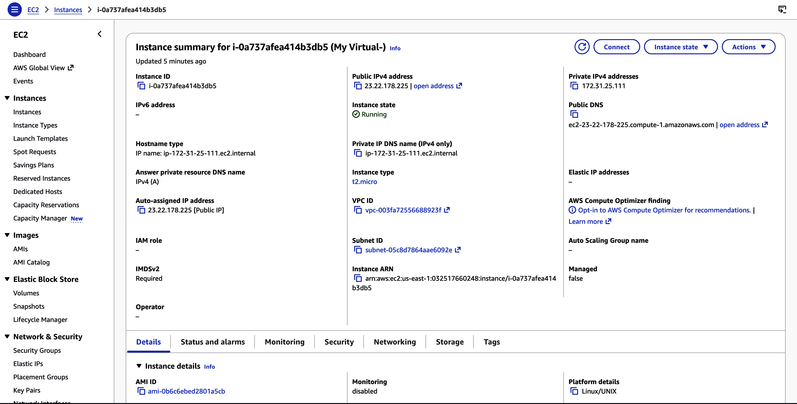
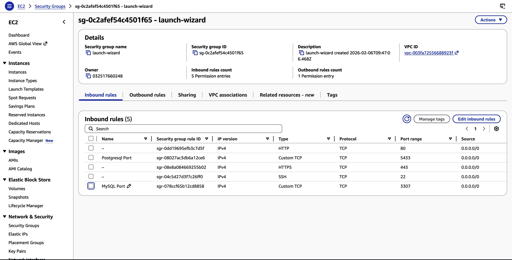
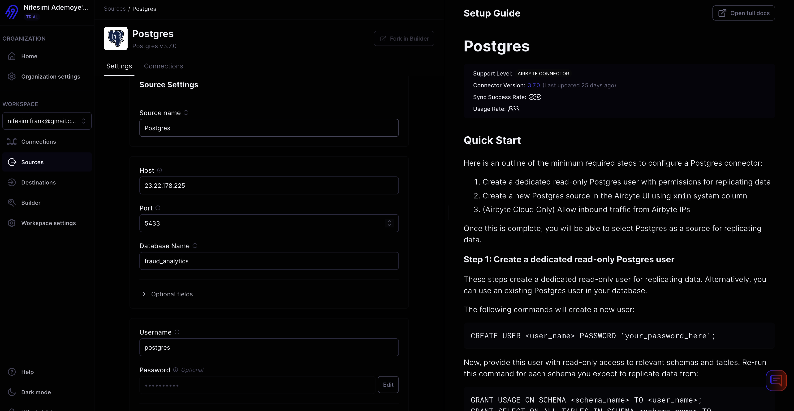
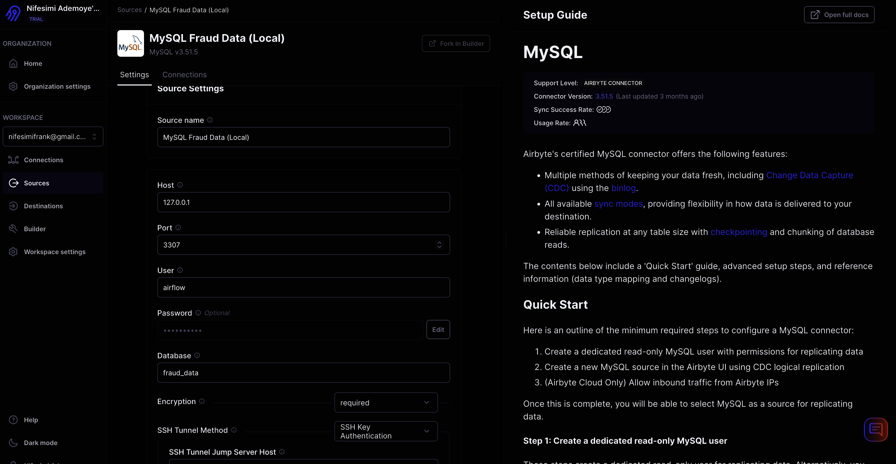

# Airflow + Airbyte Cloud Data Platform

Modern data orchestration platform with Airflow on K3s (via Rancher Desktop), Airbyte Cloud, dbt transformations, and Soda data quality checks.

> **Note**: This platform is designed to run on **Rancher Desktop** with K3s. Rancher Desktop provides a local Kubernetes environment perfect for development and testing.

## 🏗️ Architecture

### Architecture Diagram



*Complete end-to-end architecture showing data flow from sources through ingestion, quality checks, transformation, and into the data warehouse.*

### Docker Images

- **Airflow image**: The main Airflow image is built from [cicd/Dockerfile](cicd/Dockerfile). It extends the official Airflow base image and adds the project's custom Python dependencies. This image is used by the Airflow workers, scheduler, and api-server.

- **Soda image**: Soda runs in a separate, isolated image built from [cicd/Dockerfile.soda](cicd/Dockerfile.soda). It uses a plain Python slim base with only `soda-core-snowflake` installed. We keep Soda separate because Soda's dependencies can conflict with Airflow's dependency tree; running Soda in its own container (for example via a `DockerOperator` or `KubernetesPodOperator` in your DAGs) keeps the environments clean.

### Component Overview

```
┌─────────────────────────────────────────────────────────────────────┐
│    Kubernetes Cluster (K3s on Rancher Desktop - Airflow Namespace) │
├─────────────────────────────────────────────────────────────────────┤
│                                                                     │
│  📊 Orchestration Layer                                            │
│  ├── Airflow 3.0.2 (KubernetesExecutor)                             │
│  │   ├── Scheduler, Api-server, Triggerer, DAG Processor            │
│  │   └── Git-Sync (auto-syncs DAGs from GitHub)                    │
│  └── PostgreSQL 14 (Metadata) - Managed by Helm                    │
│                                                                     │
│  🗄️  Data Sources                                                  │
│  ├── PostgreSQL Source (fraud_analytics)                           │
│  └── MySQL Source (fraud_data)                                     │
│                                                                     │
│  🖥️  Management UIs                                                │
│  ├── PgAdmin (PostgreSQL management)                                │
│  └── phpMyAdmin (MySQL management)                                  │
│                                                                     │
│  🔍 Data Quality                                                    │
│  └── Soda Core (runs in isolated K8s pods via KubernetesPodOperator)│
│                                                                     │
│  💾 Persistence                                                     │
│  ├── PersistentVolume (PV) - HostPath: /tmp/airflow-logs           │
│  └── PersistentVolumeClaim (PVC) - airflow-logs (5Gi, ReadWriteMany)│
│                                                                     │
└─────────────────────────────────────────────────────────────────────┘
                         │
                         │ Reverse SSH Tunnel via EC2
                         │ (EC2:5433 → PostgreSQL, EC2:3307 → MySQL)
                         ▼
                ┌─────────────────┐
                │   AWS EC2        │
                │  Public Bridge   │
                │ 23.22.178.225   │
                └─────────────────┘
                         │
                         │ REST API (OAuth2 Client Credentials)
                         │ + Database Connections (via SSH Tunnel)
                         ▼
                ┌─────────────────┐
                │ Airbyte Cloud   │
                │ (300+ Connectors)│
                └─────────────────┘
                         │
                         │ Step 1: Syncs PostgreSQL & MySQL → S3
                         │ Step 2: Syncs S3 → Snowflake (staging schema)
                         ▼
                ┌─────────────────┐
                │   AWS S3        │
                │ (Staging Layer) │
                └─────────────────┘
                         │
                         │ Airbyte syncs to
                         ▼
                ┌─────────────────┐
                │   Snowflake     │
                │  STAGING Schema  │
                │ (Raw Data)      │
                └─────────────────┘
                         │
                         │ dbt transforms within Snowflake
                         │ (staging → marts schema)
                         ▼
                ┌─────────────────┐
                │   Snowflake     │
                │  MARTS Schema   │
                │ (customer_metrics)│
                └─────────────────┘
```

### Data Flow

1. **Data Generation**: DAGs generate sample fraud detection data in PostgreSQL and MySQL
2. **Data Ingestion (Airbyte Cloud)**:
   - Syncs PostgreSQL → AWS S3
   - Syncs MySQL → AWS S3
   - Syncs S3 → Snowflake (staging schema)
3. **Data Quality**: Soda Core validates data quality in Snowflake staging tables (isolated Kubernetes pods)
4. **Data Transformation**: dbt (via Cosmos) transforms data from Snowflake staging schema → Snowflake marts schema (creates `customer_metrics` table)
5. **Orchestration**: Airflow orchestrates the entire pipeline using KubernetesExecutor

### Core Components

- **Airflow 3.0.2** on Rancher Desktop (K3s) - Workflow orchestration with KubernetesExecutor
- **Airbyte Cloud** - Managed data ingestion (300+ connectors) via REST API
- **AWS EC2 Instance** - Public bridge for reverse SSH tunnels (enables Airbyte Cloud to reach private K3s databases)
- **Soda Core** - Data quality checks running in isolated Kubernetes pods
- **dbt (Cosmos)** - Data transformations orchestrated by Airflow
- **Snowflake** - Data warehouse for transformed analytics data
- **AWS S3** - Intermediate staging layer (PostgreSQL/MySQL → S3 → Snowflake)
- **Snowflake Staging Schema** - Raw data loaded from S3 by Airbyte
- **Snowflake Marts Schema** - Transformed data (customer_metrics table) created by dbt
- **PostgreSQL Source** - Fraud analytics database (fraud_analytics)
- **MySQL Source** - Transaction data database (fraud_data)
- **PgAdmin** - PostgreSQL management UI
- **phpMyAdmin** - MySQL management UI
- **Helm + Kubernetes** - Infrastructure as code (Helm is used for K8s resource management)
- **Persistent Volumes** - Log persistence using PV/PVC (hostPath on Rancher Desktop K3s)

### Log Persistence Architecture

Airflow logs are persisted across pod restarts using Kubernetes Persistent Volumes (PV) and Persistent Volume Claims (PVC). This is critical for maintaining log history after DAG executions, especially with KubernetesExecutor where worker pods are ephemeral.



**PersistentVolume (PV)**: `airflow-logs-pv`
- **Type**: `hostPath` (maps to `/tmp/airflow-logs` on Rancher Desktop K3s VM)
- **Size**: 5Gi
- **Access Mode**: `ReadWriteMany` (allows multiple pods to write concurrently)
- **Reclaim Policy**: `Retain` (logs preserved even if PVC is deleted)
- **Location**: Defined in `k8s/airflow-logs.yaml`
- **Rancher Desktop Note**: Uses `rdctl shell` to access the K3s VM filesystem

**PersistentVolumeClaim (PVC)**: `airflow-logs`
- **Bound to**: `airflow-logs-pv` (the PV above)
- **Size**: 5Gi
- **Access Mode**: `ReadWriteMany`
- **Used by**: All Airflow components (scheduler, webserver, triggerer, DAG processor, KubernetesExecutor worker pods)
- **Configuration**: Referenced in `airflow/values-override.yaml` via `logs.persistence.existingClaim: airflow-logs`

**Permission Setup (Rancher Desktop)**:
- The `make fix-log-permissions` command (run automatically during setup) uses `rdctl shell` to:
  - Create directory `/tmp/airflow-logs` on the Rancher Desktop K3s VM
  - Set ownership to UID 50000 (Airflow's default user)
  - Set permissions to 775 (read/write/execute for owner and group)
- This is required because:
  - Airflow runs as UID 50000 and needs write access to the hostPath volume
  - Rancher Desktop runs K3s in a VM, so we use `rdctl shell` to access the VM filesystem
  - Without proper permissions, Airflow pods cannot write logs to the hostPath volume

**Benefits**:
- ✅ DAG execution logs are preserved after task completion
- ✅ Logs are accessible even after pods restart or are recreated
- ✅ Multiple Airflow components can write logs concurrently (ReadWriteMany)
- ✅ Logs persist across Airflow upgrades and deployments
- ✅ KubernetesExecutor worker pod logs are also persisted (critical for debugging)
- ✅ Logs survive namespace deletion (if PV reclaim policy is Retain)

**Verification**:
```bash
# Check PV and PVC status
kubectl get pv airflow-logs-pv
kubectl get pvc airflow-logs -n airflow

# Check if logs directory exists on host (Rancher Desktop)
rdctl shell ls -la /tmp/airflow-logs

# View logs from a completed task
kubectl exec -n airflow deploy/airflow-scheduler -c scheduler -- ls -la /opt/airflow/logs
```

### Network Architecture: Reverse SSH Tunnel via EC2

Since Rancher Desktop runs K3s locally with no public IP addresses, and Airbyte Cloud needs to connect from the internet, we use an **AWS EC2 instance as a public bridge** with reverse SSH tunnels.

#### The Challenge

- **Rancher Desktop/K3s**: Runs locally on your machine, completely private
- **Database Pods**: PostgreSQL and MySQL pods have no public IP addresses
- **Airbyte Cloud**: Runs on the internet and needs to reach these databases
- **Solution**: EC2 instance acts as a public entry point with reverse SSH tunnels

#### Architecture Overview

```
┌─────────────────────────────────────────────────────────────────┐
│                    Airbyte Cloud (Internet)                     │
└─────────────────────────────────────────────────────────────────┘
                              │
                              │ Connects to public IP
                              ▼
┌─────────────────────────────────────────────────────────────────┐
│              AWS EC2 Instance (Public Bridge)                  │
│              Public IP: 23.22.178.225                           │
│                                                                 │
│  ┌──────────────────────────────────────────────────────────┐  │
│  │  Reverse SSH Tunnel (Port Forwarding)                   │  │
│  │  - PostgreSQL: EC2:5433 → K3s PostgreSQL Pod:5432      │  │
│  │  - MySQL: EC2:3307 → K3s MySQL Pod:3306                  │  │
│  └──────────────────────────────────────────────────────────┘  │
└─────────────────────────────────────────────────────────────────┘
                              │
                              │ SSH Tunnel
                              │ (via localhost port forwarding)
                              ▼
┌─────────────────────────────────────────────────────────────────┐
│         Your Local Machine (Rancher Desktop)                    │
│                                                                 │
│  ┌──────────────────────────────────────────────────────────┐  │
│  │  K3s Cluster (Private Network)                           │  │
│  │  ├── PostgreSQL Pod (postgres-source)                    │  │
│  │  │   └── Service: postgres-source:5432                   │  │
│  │  └── MySQL Pod (mysql)                                   │  │
│  │      └── Service: mysql:3306                             │  │
│  └──────────────────────────────────────────────────────────┘  │
└─────────────────────────────────────────────────────────────────┘
```

#### Setup Details

**1. EC2 Instance Configuration**


- **Instance Type**: `t2.micro` (sufficient for tunneling)
- **Public IP**: `23.22.178.225`
- **Security Group**: Configured with inbound rules:
  - **PostgreSQL**: Port `5433` from `0.0.0.0/0` (allows Airbyte Cloud access)
  - **MySQL**: Port `3307` from `0.0.0.0/0` (allows Airbyte Cloud access)
  - **SSH**: Port `22` from your IP (for tunnel management)
  - **HTTP/HTTPS**: Ports `80`/`443` (if needed)


**2. Reverse SSH Tunnel Setup**


The reverse SSH tunnel forwards traffic from the EC2 instance's public ports to your local K3s cluster:

**For PostgreSQL:**
```bash
# Run on your local machine (where Rancher Desktop is running)
ssh -R 5433:postgres-source.airflow.svc.cluster.local:5432 \
    -N -f user@23.22.178.225

# This creates a reverse tunnel:
# EC2:5433 → Local K3s: postgres-source service on port 5432
```

**For MySQL:**
```bash
# Run on your local machine
ssh -R 3307:mysql.airflow.svc.cluster.local:3306 \
    -N -f user@23.22.178.225

# This creates a reverse tunnel:
# EC2:3307 → Local K3s: mysql service on port 3306
```

**3. Airbyte Cloud Configuration**

**PostgreSQL Source:**
- **Host**: `23.22.178.225` (EC2 public IP)
- **Port**: `5433` (EC2 forwarded port)
- **Database**: `fraud_analytics`
- **Username**: `postgres`
- **Password**: (stored securely in Airbyte)




**MySQL Source:**
- **Host**: `127.0.0.1` (localhost on EC2, via SSH tunnel)
- **Port**: `3307` (EC2 forwarded port)
- **Database**: `fraud_data`
- **Username**: `airflow`
- **SSH Tunnel Method**: `SSH Key Authentication`
- **SSH Tunnel Jump Server Host**: `23.22.178.225` (EC2 public IP)
- **SSH Tunnel Jump Server Port**: `22`
- **SSH Tunnel Username**: (EC2 username)
- **SSH Private Key**: (EC2 SSH private key)



#### How It Works

1. **Airbyte Cloud** initiates connection to EC2 public IP (`23.22.178.225`) on ports `5433` (PostgreSQL) or `3307` (MySQL)

2. **EC2 Instance** receives the connection and forwards it through the reverse SSH tunnel to your local machine

3. **Local Machine** (where Rancher Desktop runs) receives the forwarded connection and routes it to the K3s service:
   - PostgreSQL: `postgres-source.airflow.svc.cluster.local:5432`
   - MySQL: `mysql.airflow.svc.cluster.local:3306`

4. **K3s Service** routes the connection to the appropriate pod

5. **Database Pod** processes the query and returns results back through the same tunnel

#### Benefits

- ✅ **No Public IP Required**: K3s cluster remains completely private
- ✅ **Secure**: SSH tunnels provide encrypted connections
- ✅ **Cost-Effective**: Single `t2.micro` instance handles both databases
- ✅ **Flexible**: Can add more tunnels for additional services
- ✅ **Airbyte Cloud Compatible**: Works seamlessly with Airbyte's SSH tunnel support

#### Maintaining the Tunnels

**Option 1: Manual (for testing)**
```bash
# Start PostgreSQL tunnel
ssh -R 5433:postgres-source.airflow.svc.cluster.local:5432 \
    -N -f -o ServerAliveInterval=60 \
    ec2-user@23.22.178.225

# Start MySQL tunnel
ssh -R 3307:mysql.airflow.svc.cluster.local:3306 \
    -N -f -o ServerAliveInterval=60 \
    ec2-user@23.22.178.225
```

**Option 2: Systemd Service (recommended for production)**
Create systemd services to automatically restart tunnels on failure and boot.

**Option 3: Autossh (most reliable)**
Use `autossh` which automatically reconnects if the tunnel drops:
```bash
autossh -M 20000 -R 5433:postgres-source.airflow.svc.cluster.local:5432 \
    -N -f ec2-user@23.22.178.225
```

#### Security Considerations

- **Security Group**: Only allow necessary ports from Airbyte Cloud IPs (if known) instead of `0.0.0.0/0`
- **SSH Keys**: Use SSH key authentication, never passwords
- **Firewall**: Consider using AWS Security Groups to restrict source IPs
- **Monitoring**: Monitor EC2 instance for unauthorized access attempts
- **Rotation**: Regularly rotate SSH keys and database passwords

---

## 🔄 Data Pipeline Flow

The platform implements an end-to-end fraud detection data pipeline:

1. **Data Generation** (`generate_data.py` DAG)
   - Generates sample transaction data in PostgreSQL (`customer_transactions`)
   - Generates fraud labels in MySQL (`labeled_transactions`)

2. **Data Ingestion** (`fraud_detection_with_soda_k8s.py` DAG)
   - Triggers Airbyte Cloud syncs via REST API (OAuth2 client credentials)
   - **Step 2a**: Airbyte syncs PostgreSQL → AWS S3
   - **Step 2b**: Airbyte syncs MySQL → AWS S3
   - **Step 2c**: Airbyte syncs S3 → Snowflake (staging schema)

3. **Data Quality** (Soda Core)
   - Runs data quality checks in isolated Kubernetes pods
   - Validates data in Snowflake staging schema tables
   - Checks include: freshness, completeness, validity, uniqueness
   - Ensures data quality before transformation

4. **Data Transformation** (dbt via Cosmos)
   - Transforms data from Snowflake staging schema → Snowflake marts schema
   - Creates `customer_metrics` table in the marts schema
   - Runs only after quality checks pass
   - All transformations happen within Snowflake (no data movement out)

5. **Orchestration** (Airflow)
   - Coordinates all pipeline steps
   - Uses KubernetesExecutor for scalable task execution
   - Handles retries, dependencies, and monitoring

---

## 🚀 Quick Start

### Complete Platform Setup

```bash
# Navigate to airflow directory
cd airflow

# One-command setup (installs everything)
make all

# Or step-by-step:
make clean                # Clean existing installation
make build                # Build Airflow & Soda Docker images
make install              # Install Airflow via Helm
make wait-postgres        # Wait for PostgreSQL
make migrate              # Run database migrations
make create-session       # Create session table
make patch-deployments    # Patch deployments
make wait-components      # Wait for Airflow components
make install-all-components  # Install MySQL, PostgreSQL, UIs
make setup-connections    # Configure Airflow connections (Airbyte, Snowflake, etc.)
make status               # Check deployment status
```

### Access Services

```bash
# Navigate to airflow directory first
cd airflow

# Airflow UI
make port-forward
# → http://localhost:8080 (admin/admin)

# PgAdmin (PostgreSQL management)
make port-forward-pgadmin
# → http://localhost:8888 (admin@admin.com/admin)

# phpMyAdmin (MySQL management)
make port-forward-phpmyadmin
# → http://localhost:8889 (airflow/airflow123)

# Check platform status
make status
make get-pods
make get-services
```

---

## 🔧 Setup & Configuration

### Airbyte Cloud Setup

1. **Sign up**: https://cloud.airbyte.com (free tier available)
2. **Get API credentials**: Settings → Developer → API Keys
   - Create OAuth2 application to get `client_id` and `client_secret`
3. **Create connections in Airbyte Cloud**:
   - PostgreSQL Source → S3 Destination
   - MySQL Source → S3 Destination
   - S3 Source → Snowflake Destination
4. **Update secrets**: Edit `k8s/secrets/airbyte-secrets.yaml` with your credentials
5. **Apply secrets and setup connections**: 
   ```bash
   cd airflow
   make setup-connections  # This sets up Airbyte, Snowflake, and other connections
   ```
6. **See detailed guide**: `docs/AIRBYTE_CLOUD.md`

### Snowflake Setup

1. **Create `.env` file** in the project root with:
   ```bash
   SNOWFLAKE_ACCOUNT=your_account
   SNOWFLAKE_USER=your_user
   SNOWFLAKE_PASSWORD=your_password
   SNOWFLAKE_DATABASE=FRAUD_DETECTION
   SNOWFLAKE_WAREHOUSE=your_warehouse
   SNOWFLAKE_ROLE=your_role
   ```
2. **Credentials are automatically loaded** by the Makefile and injected into Airflow pods

### Soda Data Quality Setup

1. **Soda configuration** is already in `airflow/soda/`
2. **Setup Soda K8s integration**:
   ```bash
   cd airflow
   make setup-soda-k8s  # Installs Kubernetes provider, RBAC, and Snowflake variables
   ```
3. **Soda checks run automatically** in the fraud detection pipeline DAG

---

## 📁 Project Structure

```
airflow-terraform-v2/
├── Makefile                          # Root Makefile (references airflow/Makefile)
├── README.md
│
├── airflow/                          # Airflow deployment directory
│   ├── Makefile                      # Airflow operations & commands
│   ├── values-override.yaml          # Helm values for Airflow
│   ├── requirements.txt              # Python dependencies
│   ├── dags/                         # DAG files (synced via git-sync)
│   │   ├── fraud_detection_with_soda_k8s.py
│   │   └── generate_data.py
│   └── soda/                         # Soda data quality configuration
│       ├── checks/                   # Soda check YAML files
│       │   ├── customer_staging_checks.yml
│       │   └── labeled_transactions_staging_checks.yml
│       └── configuration/           # Soda configuration
│           └── configuration.yml
│
├── cicd/                             # CI/CD Dockerfiles
│   ├── Dockerfile                    # Airflow image Dockerfile
│   └── Dockerfile.soda               # Soda image Dockerfile (ARM)
│
├── k8s/                              # Kubernetes manifests
│   ├── mysql-deployment.yaml
│   ├── postgres-source-deployment.yaml
│   ├── pgadmin-deployment.yaml
│   ├── phpmyadmin-deployment.yaml
│   ├── airflow-logs.yaml             # PV + PVC for log persistence
│   ├── airflow-worker-rbac.yaml      # RBAC for KubernetesExecutor
│   ├── logs-pvc.yaml                 # Alternative PVC (if not using PV)
│   ├── soda-configmap.yaml           # Soda config mounted in pods
│   └── secrets/
│       ├── git-secrets.yaml          # Git credentials for git-sync
│       └── airbyte-secrets.yaml      # Airbyte & Snowflake credentials
│
├── dbt/                              # dbt transformation project
│   └── fraud_analytics/
│       ├── dbt_project.yml
│       ├── profiles.yml              # Snowflake connection profile
│       └── models/
│           ├── staging/              # Staging models
│           │   └── sources.yml
│           └── marts/                # Mart models
│               ├── customer_metrics.sql
│               └── schema.yml
│
├── configs/                          # Configuration files
│   └── airflow-connections.yaml
│
└── docs/                             # Documentation
    ├── AIRBYTE_CLOUD.md
    ├── ARCHITECTURE.md
    └── DEPLOYMENT.md
```

---

## 🎯 Technology Stack

| Component | Technology | Purpose |
|-----------|-----------|---------|
| **Kubernetes** | K3s on Rancher Desktop | Container orchestration (local development) |
| **Orchestration** | Apache Airflow 3.0.2 | Workflow management |
| **Executor** | KubernetesExecutor | Task execution in isolated pods |
| **Ingestion** | Airbyte Cloud | Data integration (300+ sources) via REST API |
| **Data Quality** | Soda Core | Data quality validation in K8s pods |
| **Transformation** | dbt (via Cosmos) | SQL-based data transformations |
| **Data Warehouse** | Snowflake | Analytics data warehouse |
| **Staging** | AWS S3 | Intermediate storage for Airbyte |
| **Metadata DB** | PostgreSQL 14 | Airflow metadata storage |
| **Source DBs** | PostgreSQL 16 + MySQL 8.3 | Sample data sources |
| **DB Management** | PgAdmin + phpMyAdmin | Database administration |
| **DAG Sync** | Git-Sync | Automatic DAG synchronization from GitHub |
| **Deployment** | Helm 3.x | Package management & infrastructure as code |
| **Automation** | Makefiles | Build & deployment automation |

> **Note on Infrastructure Management**: This project uses **Helm** instead of Terraform for infrastructure management. Helm provides all the necessary capabilities for Kubernetes deployments:
> - **Helm Charts** manage complex Kubernetes applications (Airflow, PostgreSQL, etc.)
> - **Values files** (`values-override.yaml`) provide configuration management
> - **Kubernetes manifests** (`k8s/*.yaml`) handle additional resources (PVs, PVCs, ConfigMaps, Secrets)
> - **Helm hooks and lifecycle management** handle deployment ordering and dependencies
> 
> For a Kubernetes-native project like this, Helm is the appropriate tool as it's designed specifically for managing Kubernetes resources, whereas Terraform would be better suited for cloud infrastructure provisioning (VPCs, load balancers, etc.) which isn't needed in this local development setup.

---

## 📋 Command Reference

### Setup & Deployment

| Command | Description |
|---------|-------------|
| `make all` | Complete platform setup (Airflow + all components) |
| `make clean` | Clean existing installation |
| `make build` | Build Airflow & Soda Docker images |
| `make install` | Deploy Airflow on Kubernetes via Helm |
| `make install-all-components` | Deploy data sources and management UIs |
| `make setup-connections` | Configure Airflow connections (Airbyte, Snowflake, MySQL, PostgreSQL) |
| `make setup-soda-k8s` | Setup Soda data quality integration with Kubernetes |
| `make fix-log-permissions` | Fix hostPath log volume permissions (Rancher Desktop K3s VM) |
| `make upgrade` | Upgrade Airflow with new image |

### UI Access

| Command | Description |
|---------|-------------|
| `make port-forward` | Port-forward to Airflow UI → http://localhost:8080 |
| `make port-forward-pgadmin` | Port-forward to PgAdmin → http://localhost:8888 |
| `make port-forward-phpmyadmin` | Port-forward to phpMyAdmin → http://localhost:8889 |
| `make port-forward-mysql` | Port-forward to MySQL → localhost:3307 |
| `make port-forward-postgres-source` | Port-forward to PostgreSQL source → localhost:5433 |

### Status & Monitoring

| Command | Description |
|---------|-------------|
| `make status-all` | Show all pod and service status |
| `make health-check` | Run health checks on all components |
| `make logs-scheduler` | View Airflow scheduler logs |
| `make logs-webserver` | View Airflow webserver logs |
| `make logs-mysql` | View MySQL logs |
| `make logs-postgres-source` | View PostgreSQL source logs |
| `make debug` | Show comprehensive debug information |

### DAG Operations

| Command | Description |
|---------|-------------|
| `make list-dags` | List all available DAGs |
| `make trigger DAG=my_dag` | Trigger specific DAG |
| `make pause DAG=my_dag` | Pause a DAG |
| `make unpause DAG=my_dag` | Unpause a DAG |

### Database Management

| Command | Description |
|---------|-------------|
| `make port-forward-mysql` | Port-forward to MySQL (localhost:3307) |
| `make port-forward-postgres-source` | Port-forward to PostgreSQL source (localhost:5433) |
| `make shell-mysql` | Open MySQL shell |
| `make shell-postgres-source` | Open PostgreSQL source shell |
| `make shell-postgres` | Open Airflow metadata PostgreSQL shell |
| `make test-mysql` | Test MySQL connection with sample query |
| `make test-postgres-source` | Test PostgreSQL connection with sample query |

### Connections

| Command | Description |
|---------|-------------|
| `make list-connections` | List all Airflow connections |
| `make add-connection CONN_ID=... CONN_TYPE=... CONN_HOST=...` | Add custom connection |

### Maintenance

| Command | Description |
|---------|-------------|
| `make restart` | Restart all Airflow pods |
| `make upgrade` | Upgrade Airflow with new image |
| `make cleanup-pods` | Remove failed/error pods |
| `make reinstall` | Complete reinstall (uninstall + install) |
| `make reset-db` | Reset Airflow database (WARNING: deletes all data) |

### Teardown

| Command | Description |
|---------|-------------|
| `make uninstall-components` | Remove databases and UIs only |
| `make uninstall-airflow` | Remove Airflow only |
| `make uninstall-all` | Remove everything (requires confirmation) |

### Soda Data Quality

| Command | Description |
|---------|-------------|
| `make setup-soda-k8s` | Complete Soda + Kubernetes setup |
| `make test-soda-dag` | Test Soda K8s DAG |
| `make logs-soda-check` | View Soda quality check logs |
| `make check-soda-status` | Complete status check for Soda integration |
| `make verify-k8s-provider` | Verify Kubernetes provider is installed |
| `make verify-soda-image` | Test if Soda Docker image is accessible |
| `make soda-help` | Show Soda integration help |

### Fraud Detection Pipeline

| Command | Description |
|---------|-------------|
| `make setup-fraud-pipeline` | Setup fraud detection pipeline variables |
| `make trigger-fraud-pipeline` | Trigger fraud detection pipeline DAG |
| `make fraud-pipeline-status` | Show fraud pipeline execution status |
| `make verify-fraud-data` | Verify fraud detection data in databases |
| `make fraud-pipeline-help` | Show fraud pipeline setup guide |

---

## 💾 Database Information

### PostgreSQL Source (fraud_analytics)

**Access via PgAdmin**: http://localhost:8888
**Direct connection**: `psql -h 127.0.0.1 -p 5433 -U postgres -d fraud_analytics`
**Password**: `postgres`

**Sample Tables**:
- `customer_profiles` - Customer information with risk scores
- `account_activity` - Login and activity logs
- `transaction_logs` - Transaction records
- `customer_transactions` - Transaction data generated by DAGs

### MySQL Source (fraud_data)

**Access via phpMyAdmin**: http://localhost:8889
**Direct connection**: `mysql -h 127.0.0.1 -P 3307 -u airflow -p`
**Password**: `airflow123` (user: airflow) or `rootpassword` (user: root)

**Sample Tables**:
- `transactions` - Transaction records with fraud flags
- `labeled_transactions` - Fraud labels generated by DAGs

### Airflow Metadata (PostgreSQL)

**Managed by**: Helm chart (not accessible via PgAdmin)
**Shell access**: `make shell-postgres`
**Password**: `postgres`

---

## 🛠️ Requirements

### Software
- **Rancher Desktop** (required - this platform is designed for K3s on Rancher Desktop)
  - Includes K3s Kubernetes distribution
  - Includes `rdctl` CLI for VM access
  - 8GB+ RAM recommended (configure in Rancher Desktop settings)
- **kubectl** (Kubernetes CLI - usually included with Rancher Desktop)
- **helm** (v3.x - install via Rancher Desktop or Homebrew)
- **make** (build automation - install via Homebrew: `brew install make`)
- **Airbyte Cloud account** (free tier available)
- **Snowflake account** (for data warehouse)
- **AWS account** (for S3 staging layer)

### Environment Variables

Create a `.env` file in the project root with the following variables:

```bash
# Snowflake Credentials
SNOWFLAKE_ACCOUNT=your_account
SNOWFLAKE_USER=your_user
SNOWFLAKE_PASSWORD=your_password
SNOWFLAKE_DATABASE=FRAUD_DETECTION
SNOWFLAKE_WAREHOUSE=your_warehouse
SNOWFLAKE_ROLE=your_role

# Airbyte Cloud Credentials
AIRBYTE_CLIENT_ID=your_client_id
AIRBYTE_CLIENT_SECRET=your_client_secret
AIRBYTE_CONN_POSTGRES_S3=connection_id_1
AIRBYTE_CONN_MYSQL_S3=connection_id_2
AIRBYTE_CONN_S3_SNOWFLAKE=connection_id_3
AIRBYTE_WORKSPACE_ID=your_workspace_id
```

The Makefile automatically loads these from `.env` and injects them into Kubernetes secrets.

### System Resources
- **RAM**: 8GB minimum, 16GB recommended
- **CPU**: 4 cores minimum
- **Disk**: 20GB free space

### Rancher Desktop Setup

1. **Install Rancher Desktop**: Download from https://rancherdesktop.io/
2. **Configure Resources**:
   - Open Rancher Desktop settings
   - Set CPU: 4+ cores
   - Set Memory: 8GB+ (16GB recommended)
   - Set Disk: 20GB+ free space
3. **Start Rancher Desktop** and wait for K3s to be ready
4. **Verify K3s is running**:
   ```bash
   kubectl get nodes
   # Should show: rancher-desktop
   ```

### Verification
```bash
# Check Rancher Desktop and K3s
kubectl version --client
kubectl get nodes
rdctl version

# Check other tools
helm version
docker --version
make --version
```

---

## 👨‍💻 Local Development

### Adding a New DAG

**Option 1: Using Git Sync (Recommended)**

Your DAGs are automatically synced from GitHub:
- Repository: https://github.com/nifesimii/Fraud-Airbyte-Project.git
- Branch: `main`
- Path: `airflow/dags`
- Sync interval: 60 seconds

```bash
# 1. Push DAG to GitHub repository
cd ~/Documents/git-projects/Fraud-Airbyte-Project
git add airflow/dags/my_new_dag.py
git commit -m "Add new DAG"
git push

# 2. Wait 60 seconds for git-sync to pull changes
# 3. Verify DAG appears
cd airflow
make list-dags
```

**Option 2: Rebuild Image (For testing)**

```bash
# 1. Create DAG file locally
vim airflow/dags/my_new_dag.py

# 2. Rebuild Airflow image
cd airflow
make build

# 3. Upgrade deployment
make upgrade

# 4. Verify DAG appears
make list-dags
```

### Updating Dependencies

```bash
# 1. Edit requirements.txt
vim airflow/requirements.txt

# 2. Rebuild and upgrade
cd airflow
make build
make upgrade
```

### Working with dbt

The dbt project is located in `dbt/fraud_analytics/` and is orchestrated via Cosmos in Airflow DAGs.

```bash
# Test dbt locally (requires Snowflake credentials)
cd dbt/fraud_analytics
dbt debug
dbt run
dbt test
```

### Working with Soda

Soda configuration files are in `airflow/soda/`:
- `soda/configuration/configuration.yml` - Soda configuration
- `soda/checks/*.yml` - Data quality check definitions

Soda checks run in isolated Kubernetes pods via `KubernetesPodOperator` in the fraud detection DAG.

---

## 🔍 Monitoring & Debugging

### Quick Health Check

```bash
# Check all components
make health-check

# Expected output:
# Airflow Scheduler: ✓
# Airflow Webserver: ✓
# Airflow PostgreSQL: ✓
# Source MySQL: ✓
# Source PostgreSQL: ✓
# PgAdmin: ✓
# phpMyAdmin: ✓
```

### View Logs

```bash
# Airflow components
make logs-scheduler
make logs-webserver
make logs-api
make logs-triggerer
make logs-dag-processor

# Databases
make logs-mysql
make logs-postgres-source

# Management UIs
make logs-pgadmin
make logs-phpmyadmin

# Soda quality checks
make logs-soda-check

# All pods
kubectl logs -n airflow -l tier=airflow --tail=100 -f
```

### Debug Issues

```bash
# Comprehensive debug info
make debug

# Check specific pod
kubectl describe pod -n airflow <pod-name>

# Get pod events
kubectl get events -n airflow --sort-by='.lastTimestamp'

# Check resource usage
kubectl top pods -n airflow
```

### Common Issues

#### Pods Not Starting
```bash
# Check pod status
kubectl get pods -n airflow

# Describe failing pod
kubectl describe pod -n airflow <pod-name>

# Check logs
kubectl logs -n airflow <pod-name>
```

#### Can't Access UI
```bash
# Verify service is running
kubectl get svc -n airflow

# Ensure port-forward is active
make airflow-ui  # Run in dedicated terminal
```

#### Database Connection Errors
```bash
# Test connections
make test-mysql
make test-postgres-source

# Verify Airflow connections
make list-connections

# Re-add connections
make setup-connections
```

#### Rancher Desktop Specific Issues

**K3s not starting**:
```bash
# Check Rancher Desktop status
rdctl status

# Restart Rancher Desktop
# Via UI: Rancher Desktop → Settings → Kubernetes → Reset Kubernetes

# Or via CLI
rdctl shutdown
# Then restart Rancher Desktop application
```

**Permission errors with hostPath volumes**:
```bash
# Re-run permission fix
cd airflow
make fix-log-permissions

# Verify directory exists and has correct permissions
rdctl shell ls -la /tmp/airflow-logs
rdctl shell stat /tmp/airflow-logs
```

**Cannot access K3s VM**:
```bash
# Verify rdctl is installed
rdctl version

# Test VM access
rdctl shell echo "K3s VM is accessible"

# If rdctl not found, ensure Rancher Desktop is running
# rdctl is included with Rancher Desktop installation
```

**Pods stuck in Pending (volume mount issues)**:
```bash
# Check PV/PVC status
kubectl get pv
kubectl get pvc -n airflow

# Check pod events for volume mount errors
kubectl describe pod <pod-name> -n airflow | grep -A 10 Events

# Recreate PV/PVC if needed
kubectl delete pvc airflow-logs -n airflow
kubectl delete pv airflow-logs-pv
cd airflow
make fix-log-permissions
kubectl apply -f ../k8s/airflow-logs.yaml
```

---

## 🚀 Production Considerations

### Before Production Deployment

#### Security
- [ ] Change all default passwords
- [ ] Use Kubernetes secrets for sensitive data
- [ ] Enable SSL/TLS for all services
- [ ] Set up RBAC (Role-Based Access Control)
- [ ] Use external secrets manager (Vault, AWS Secrets Manager)
- [ ] Enable pod security policies

#### Persistence
- [x] Enable persistent volumes for Airflow logs (PV + PVC configured)
- [ ] Configure database backups
- [ ] Set up disaster recovery plan
- [ ] Use external PostgreSQL for metadata (not Helm-managed)
- [ ] Consider using network-attached storage (NFS) for production (instead of hostPath)

#### Scalability
- [x] Configure KubernetesExecutor (already configured)
- [ ] Set up autoscaling for worker pods
- [ ] Configure resource limits and requests
- [ ] Set up horizontal pod autoscaling

#### Monitoring
- [ ] Set up Prometheus metrics
- [ ] Configure Grafana dashboards
- [ ] Enable logging aggregation (ELK, Loki)
- [ ] Set up alerting (PagerDuty, Slack)

#### Airflow Configuration
- [ ] Set static webserver secret key
- [ ] Configure email notifications
- [ ] Set up external logging (S3, GCS)
- [ ] Enable audit logs
- [ ] Configure connection pooling

### Executor Configuration

This platform uses **KubernetesExecutor**, which means:
- Each Airflow task runs in its own isolated Kubernetes pod
- Tasks can scale independently based on workload
- No need for a separate worker deployment (workers are created on-demand)
- RBAC is configured via `k8s/airflow-worker-rbac.yaml` to allow pod creation

**Current Configuration** (in `airflow/values-override.yaml`):
```yaml
executor: "KubernetesExecutor"
cleanUpPods: false  # Keep pods for debugging
workers:
  replicas: 0  # No static workers needed
```

### Production Helm Values

```yaml
# Example production values
executor: "KubernetesExecutor"
cleanUpPods: true  # Clean up completed pods

postgresql:
  enabled: false  # Use external DB

externalDatabase:
  host: prod-postgres.example.com
  database: airflow
  user: airflow
  passwordSecret: airflow-postgres-secret

logs:
  persistence:
    enabled: true
    existingClaim: airflow-logs  # Use existing PVC
    # OR create new PVC:
    # size: 100Gi
    # storageClassName: fast-ssd

webserver:
  replicas: 2
  resources:
    limits:
      cpu: 2000m
      memory: 4Gi

kubernetesExecutor:
  delete_worker_pods: true
  delete_worker_pods_on_failure: true
```

---

## 🧪 Testing

### Unit Tests
```bash
# Test database connections
make test-all

# Test individual databases
make test-mysql
make test-postgres-source
```

### Integration Tests
```bash
# Test DAG integrity
cd airflow
make shell-scheduler
airflow dags test fraud_detection_with_soda_k8s 2024-01-01
```

### Load Tests
```bash
# Trigger multiple DAGs
for i in {1..10}; do make trigger DAG=test_dag; done

# Monitor resource usage
kubectl top pods -n airflow
```

---

## 📚 Documentation

- **Airbyte Integration**: `docs/AIRBYTE_CLOUD.md`
- **Architecture Details**: `docs/ARCHITECTURE.md`
- **Deployment Guide**: `docs/DEPLOYMENT.md`
- **Troubleshooting**: `docs/TROUBLESHOOTING.md`
- **Makefile Updates**: `MAKEFILE-UPDATES-SUMMARY.md`

---

## 🤝 Contributing

1. Fork the repository
2. Create a feature branch (`git checkout -b feature/amazing-feature`)
3. Commit your changes (`git commit -m 'Add amazing feature'`)
4. Push to the branch (`git push origin feature/amazing-feature`)
5. Open a Pull Request

---

## 📝 License

MIT License - see LICENSE file for details

---

## 🙏 Acknowledgments

- Apache Airflow community
- Airbyte team for cloud platform
- Rancher Desktop for K3s distribution
- Helm chart maintainers

---

## 📞 Support

- **Issues**: GitHub Issues
- **Discussions**: GitHub Discussions
- **Documentation**: `docs/` directory
- **Airflow Docs**: https://airflow.apache.org/docs/
- **Airbyte Docs**: https://docs.airbyte.com/

---

## 🗺️ Roadmap

- [x] Add dbt integration for transformations (via Cosmos)
- [x] Implement Soda for data quality checks
- [x] Create fraud detection DAGs with end-to-end pipeline
- [x] Configure KubernetesExecutor for scalable task execution
- [x] Set up Git-sync for automatic DAG deployment
- [ ] Add Prometheus/Grafana monitoring stack
- [ ] Add CI/CD pipeline with GitHub Actions
- [ ] Implement data lineage tracking
- [ ] Add machine learning pipeline examples

---

**Happy Data Engineering! 🚀**